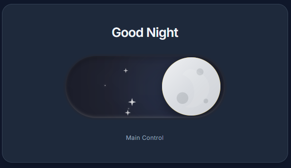

# Day/Night Toggle Switch

A beautiful, animated, and scalable Day/Night toggle switch component built with **React**, **Tailwind CSS**, and **TypeScript**.



[Sample page](https://godzil.github.io/DayNightToggle/)

## Features

- **Smooth Animations**: complex CSS transitions for the sun/moon eclipse effect, clouds, and stars.
- **Procedural Generation**: "Night" mode stars are generated deterministically based on a `seed` prop, allowing for unique but stable constellations.
- **Scalable**: Fully vector-based and scalable via a `scale` prop without losing quality or breaking layout.
- **Accessible**: Includes proper ARIA attributes and keyboard support (`Enter`/`Space` to toggle).
- **Responsive**: Built with Tailwind CSS.

## Usage

### Installation

1. Clone the repository.
2. Install dependencies:
   ```bash
   npm install
   ```

### Running Locally

```bash
npm start
```

### Component Props

| Prop | Type | Default | Description |
|------|------|---------|-------------|
| `isNight` | `boolean` | Required | Current state of the toggle. |
| `onToggle` | `() => void` | Required | Callback function when clicked. |
| `scale` | `number` | `1` | Scaling factor (e.g., `0.5`, `1.5`). |
| `seed` | `number` | `0` | Seed for random star generation. |

## Deployment

To publish the demo page to GitHub Pages:

1. The `docs/` folder contains a standalone `index.html`.
2. Configure GitHub Pages to serve from the `/docs` folder or root depending on your repository structure.

## Technologies

- React 18+
- Tailwind CSS
- TypeScript
- Vite / CRA (depending on setup)
